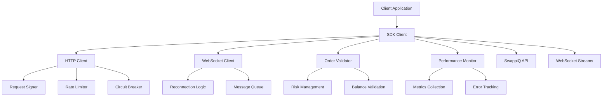

# SwappiQ Protocol SDK - Comprehensive Documentation

## Table of Contents

1. [Overview](#overview)
2. [Architecture](#architecture)
3. [Security Guidelines](#security-guidelines)
4. [Performance Optimization](#performance-optimization)
5. [API Reference](#api-reference)
6. [Error Handling](#error-handling)
7. [Best Practices](#best-practices)
8. [Troubleshooting](#troubleshooting)
9. [Migration Guide](#migration-guide)
10. [Contributing](#contributing)

## Overview

The SwappiQ Protocol SDK provides enterprise-grade tools for interacting with decentralized exchanges and trading protocols. Available in TypeScript, Python, and Go, the SDK offers type-safe APIs, automatic retry logic, comprehensive validation, and production-ready error handling.

### Key Features

- ✅ **Type-safe API clients** with comprehensive error handling
- ✅ **Automatic retry** with exponential backoff and jitter
- ✅ **Request signing utilities** with HMAC-SHA256/SHA512 support
- ✅ **WebSocket client** with automatic reconnection and heartbeat
- ✅ **Local order validation** with business logic and risk checks
- ✅ **Rate limiting** with priority queues and adaptive behavior
- ✅ **Performance monitoring** with detailed metrics and alerting
- ✅ **Security features** including timing-safe comparisons and input sanitization
- ✅ **Circuit breaker patterns** for resilience and fault tolerance
- ✅ **Comprehensive logging** with sensitive data protection

### Supported Languages

| Language   | Version | Status | Documentation |
|------------|---------|--------|---------------|
| TypeScript | 5.0+    | ✅ Stable | [TypeScript Guide](./typescript/README.md) |
| Python     | 3.8+    | ✅ Stable | [Python Guide](./python/README.md) |
| Go         | 1.21+   | ✅ Stable | [Go Guide](./go/README.md) |

## Architecture

### High-Level Design



### Component Overview

#### Core Components

1. **HTTP Client**
   - Connection pooling and reuse
   - Automatic retry with exponential backoff
   - Request/response caching with TTL
   - Circuit breaker for fault tolerance
   - Comprehensive error handling

2. **WebSocket Client**
   - Automatic reconnection with backoff
   - Message queuing and processing
   - Heartbeat/ping-pong mechanism
   - Event-driven architecture
   - Graceful degradation to HTTP

3. **Order Validator**
   - Local validation before API calls
   - Risk management integration
   - Balance sufficiency checks
   - Trading pair validation
   - Fee estimation

4. **Request Signer**
   - HMAC-SHA256/SHA512 signing
   - Timing-safe signature verification
   - Nonce generation and management
   - Webhook signature validation

5. **Performance Monitor**
   - Real-time metrics collection
   - Performance bottleneck detection
   - Memory and resource monitoring
   - Error rate tracking
   - Alerting integration

## Security Guidelines

### Authentication and Authorization

#### API Key Management

```typescript
// ✅ GOOD: Use environment variables
const config = {
  auth: {
    apiKey: process.env.SWAPPIQ_API_KEY,
    apiSecret: process.env.SWAPPIQ_API_SECRET,
    environment: 'production'
  }
};

// ❌ BAD: Hard-coded credentials
const config = {
  auth: {
    apiKey: 'sk_abcd1234...',
    apiSecret: 'secret123...'
  }
};
```

#### Secure Credential Storage

```typescript
// Node.js - Use secure environment variable management
import { config } from 'dotenv';
config();

// Browser - Use secure storage APIs
const credentials = {
  apiKey: await window.crypto.subtle.importKey(/* encrypted key */),
  apiSecret: await getSecureCredential('api_secret')
};
```

#### Request Signing Security

```typescript
// Secure request signing with timing-safe comparison
class SecureRequestSigner extends RequestSigner {
  protected compareSignatures(sig1: string, sig2: string): boolean {
    // Always use timing-safe comparison
    return crypto.timingSafeEqual(
      Buffer.from(sig1, 'hex'),
      Buffer.from(sig2, 'hex')
    );
  }
  
  protected sanitizeForLogging(data: any): any {
    // Remove all sensitive fields before logging
    const sanitized = { ...data };
    const sensitiveFields = ['signature', 'apiSecret', 'privateKey'];
    
    for (const field of sensitiveFields) {
      if (sanitized[field]) {
        sanitized[field] = '[REDACTED]';
      }
    }
    
    return sanitized;
  }
}
```

### Input Validation and Sanitization

#### Comprehensive Input Validation

```typescript
// Enhanced decimal validation
function validateDecimal(value: string, fieldName: string): ValidationResult {
  // Type checking
  if (typeof value !== 'string') {
    return { valid: false, error: `${fieldName} must be a string` };
  }
  
  // Format validation
  if (!/^\d+(\.\d+)?$/.test(value.trim())) {
    return { valid: false, error: `${fieldName} has invalid format` };
  }
  
  // Numeric validation
  const num = parseFloat(value);
  if (!Number.isFinite(num) || num < 0) {
    return { valid: false, error: `${fieldName} must be a positive number` };
  }
  
  // Precision validation
  const decimals = (value.split('.')[1] || '').length;
  if (decimals > 18) {
    return { valid: false, error: `${fieldName} has too many decimal places` };
  }
  
  // Range validation
  if (num > Number.MAX_SAFE_INTEGER) {
    return { valid: false, error: `${fieldName} exceeds maximum value` };
  }
  
  return { valid: true, value: num };
}
```

#### SQL Injection Prevention

```typescript
// Use parameterized queries and input validation
class DatabaseQuery {
  async getUserOrders(userId: string, limit: number = 100): Promise<Order[]> {
    // Validate inputs
    if (!this.isValidUserId(userId)) {
      throw new Error('Invalid user ID format');
    }
    
    if (limit <= 0 || limit > 1000) {
      throw new Error('Limit must be between 1 and 1000');
    }
    
    // Use parameterized query
    const query = 'SELECT * FROM orders WHERE user_id = ? LIMIT ?';
    return this.db.query(query, [userId, limit]);
  }
  
  private isValidUserId(userId: string): boolean {
    return /^[a-zA-Z0-9_-]+$/.test(userId) && userId.length <= 64;
  }
}
```

### Network Security

#### TLS/SSL Configuration

```typescript
// Enforce secure connections
const httpsAgent = new https.Agent({
  minVersion: 'TLSv1.2',
  ciphers: [
    'ECDHE-RSA-AES128-GCM-SHA256',
    'ECDHE-RSA-AES256-GCM-SHA384',
    'ECDHE-RSA-AES128-SHA256',
    'ECDHE-RSA-AES256-SHA384'
  ].join(':'),
  honorCipherOrder: true
});

// Certificate pinning (optional but recommended)
const pinnedCertificates = [
  'sha256/AAAAAAAAAAAAAAAAAAAAAAAAAAAAAAAAAAAAAAAAAAA=',
  'sha256/BBBBBBBBBBBBBBBBBBBBBBBBBBBBBBBBBBBBBBBBBBB='
];
```

#### Request/Response Encryption

```typescript
// Additional encryption layer for sensitive data
class EncryptedApiClient extends ApiClient {
  private async encryptSensitiveData(data: any): Promise<string> {
    const key = await this.getDerivedKey();
    const encrypted = await crypto.subtle.encrypt(
      { name: 'AES-GCM', iv: crypto.getRandomValues(new Uint8Array(12)) },
      key,
      new TextEncoder().encode(JSON.stringify(data))
    );
    return btoa(String.fromCharCode(...new Uint8Array(encrypted)));
  }
  
  private async decryptSensitiveData(encryptedData: string): Promise<any> {
    const key = await this.getDerivedKey();
    const data = Uint8Array.from(atob(encryptedData), c => c.charCodeAt(0));
    const decrypted = await crypto.subtle.decrypt(
      { name: 'AES-GCM', iv: data.slice(0, 12) },
      key,
      data.slice(12)
    );
    return JSON.parse(new TextDecoder().decode(decrypted));
  }
}
```

## Performance Optimization

### Connection Management

#### HTTP Connection Pooling

```typescript
// Optimized HTTP agent configuration
const httpAgent = new https.Agent({
  keepAlive: true,
  keepAliveMsecs: 30000,
  maxSockets: 50,
  maxFreeSockets: 10,
  timeout: 60000,
  freeSocketTimeout: 30000
});

// Connection monitoring
class ConnectionMonitor {
  private connectionStats = new Map<string, ConnectionMetrics>();
  
  trackConnection(host: string, metrics: ConnectionMetrics): void {
    this.connectionStats.set(host, metrics);
    
    // Alert on connection issues
    if (metrics.errorRate > 0.05) {
      this.alertHighErrorRate(host, metrics);
    }
  }
}
```

#### WebSocket Optimization

```typescript
// Efficient WebSocket message handling
class OptimizedWebSocketClient {
  private messageQueue: Message[] = [];
  private processingBatch = false;
  
  private async processMessages(): Promise<void> {
    if (this.processingBatch || this.messageQueue.length === 0) {
      return;
    }
    
    this.processingBatch = true;
    
    try {
      // Process messages in batches for better performance
      const batchSize = 100;
      while (this.messageQueue.length > 0) {
        const batch = this.messageQueue.splice(0, batchSize);
        await Promise.all(batch.map(msg => this.handleMessage(msg)));
      }
    } finally {
      this.processingBatch = false;
    }
  }
}
```

### Caching Strategies

#### Multi-Level Caching

```typescript
// L1: Memory cache for hot data
// L2: Local storage for persistent data
// L3: Distributed cache for shared data

class MultiLevelCache {
  private l1Cache = new Map<string, CacheEntry>();
  private l2Cache = new LocalStorageCache();
  private l3Cache = new RedisCache();
  
  async get(key: string): Promise<any> {
    // Check L1 first (fastest)
    let entry = this.l1Cache.get(key);
    if (entry && !this.isExpired(entry)) {
      return entry.value;
    }
    
    // Check L2 (medium speed)
    entry = await this.l2Cache.get(key);
    if (entry && !this.isExpired(entry)) {
      this.l1Cache.set(key, entry); // Promote to L1
      return entry.value;
    }
    
    // Check L3 (slower but shared)
    entry = await this.l3Cache.get(key);
    if (entry && !this.isExpired(entry)) {
      this.l1Cache.set(key, entry);
      await this.l2Cache.set(key, entry);
      return entry.value;
    }
    
    return null;
  }
}
```

#### Cache Invalidation

```typescript
// Smart cache invalidation with dependency tracking
class SmartCache {
  private dependencies = new Map<string, Set<string>>();
  
  set(key: string, value: any, ttl: number, deps: string[] = []): void {
    this.cache.set(key, { value, expires: Date.now() + ttl });
    
    // Track dependencies
    for (const dep of deps) {
      const depSet = this.dependencies.get(dep) || new Set();
      depSet.add(key);
      this.dependencies.set(dep, depSet);
    }
  }
  
  invalidate(key: string): void {
    // Invalidate this key
    this.cache.delete(key);
    
    // Invalidate dependent keys
    const dependents = this.dependencies.get(key);
    if (dependents) {
      for (const dependent of dependents) {
        this.invalidate(dependent);
      }
    }
  }
}
```

### Memory Management

#### Object Pooling

```typescript
// Reduce garbage collection pressure with object pooling
class RequestPool {
  private available: Request[] = [];
  private inUse = new Set<Request>();
  
  acquire(): Request {
    let request = this.available.pop();
    if (!request) {
      request = this.createRequest();
    }
    
    this.inUse.add(request);
    return request;
  }
  
  release(request: Request): void {
    if (this.inUse.has(request)) {
      this.inUse.delete(request);
      this.resetRequest(request);
      this.available.push(request);
    }
  }
  
  private resetRequest(request: Request): void {
    request.headers = {};
    request.body = null;
    request.metadata = {};
  }
}
```

#### Memory Monitoring

```typescript
// Automatic memory leak detection
class MemoryMonitor {
  private measurements: MemoryMeasurement[] = [];
  
  startMonitoring(): void {
    setInterval(() => {
      const usage = process.memoryUsage();
      this.measurements.push({
        timestamp: Date.now(),
        heapUsed: usage.heapUsed,
        heapTotal: usage.heapTotal,
        external: usage.external
      });
      
      this.checkForLeaks();
    }, 30000); // Every 30 seconds
  }
  
  private checkForLeaks(): void {
    if (this.measurements.length < 10) return;
    
    const recent = this.measurements.slice(-10);
    const trend = this.calculateTrend(recent.map(m => m.heapUsed));
    
    if (trend > 0.1) { // 10% growth trend
      this.alertMemoryLeak(trend);
    }
  }
}
```

## API Reference

### Client Initialization

#### TypeScript

```typescript
import { SwappiQClient, SDKConfig } from '@swappiq/sdk';

const config: SDKConfig = {
  apiUrl: 'https://api.swappiq.com',
  wsUrl: 'wss://ws.swappiq.com',
  auth: {
    apiKey: process.env.SWAPPIQ_API_KEY!,
    apiSecret: process.env.SWAPPIQ_API_SECRET!,
    environment: 'production'
  },
  network: 'ethereum',
  timeout: 30000,
  retryConfig: {
    maxAttempts: 3,
    baseDelay: 1000,
    maxDelay: 10000,
    backoffFactor: 2.0,
    jitter: true
  }
};

const client = new SwappiQClient(config);
await client.connect();
```

#### Python

```python
from swappiq_sdk import SwappiQClient, SDKConfig, AuthCredentials

config = SDKConfig(
    api_url='https://api.swappiq.com',
    ws_url='wss://ws.swappiq.com',
    auth=AuthCredentials(
        api_key=os.getenv('SWAPPIQ_API_KEY'),
        api_secret=os.getenv('SWAPPIQ_API_SECRET'),
        environment='production'
    ),
    network='ethereum',
    timeout=30.0
)

client = SwappiQClient(config)
await client.connect()
```

#### Go

```go
package main

import (
    "context"
    "time"
    
    "github.com/swappiq/sdk-go"
)

func main() {
    config := swappiq.SDKConfig{
        APIURL: "https://api.swappiq.com",
        WSURL:  &[]string{"wss://ws.swappiq.com"}[0],
        Auth: &swappiq.AuthCredentials{
            APIKey:      os.Getenv("SWAPPIQ_API_KEY"),
            APISecret:   os.Getenv("SWAPPIQ_API_SECRET"),
            Environment: "production",
        },
        Network: swappiq.NetworkEthereum,
        Timeout: 30 * time.Second,
    }
    
    client, err := swappiq.NewClient(config)
    if err != nil {
        log.Fatal(err)
    }
    
    ctx := context.Background()
    if err := client.Connect(ctx); err != nil {
        log.Fatal(err)
    }
    defer client.Disconnect()
}
```

### Trading Operations

#### Place Order

```typescript
// TypeScript
const orderRequest: CreateOrderRequest = {
  tradingPair: 'ETH-USDC',
  side: 'buy',
  type: 'limit',
  quantity: '1.0',
  price: '2000.00',
  timeInForce: 'GTC'
};

// Validate order locally first
const validation = await client.validateOrder(orderRequest);
if (!validation.valid) {
  console.error('Order validation failed:', validation.errors);
  return;
}

// Submit order
const response = await client.createOrder(orderRequest);
if (response.success) {
  console.log('Order created:', response.order.id);
} else {
  console.error('Order failed:', response.error.message);
}
```

```python
# Python
order_request = CreateOrderRequest(
    trading_pair='ETH-USDC',
    side=OrderSide.BUY,
    type=OrderType.LIMIT,
    quantity='1.0',
    price='2000.00',
    time_in_force=TimeInForce.GTC
)

# Validate and submit
validation = await client.validate_order(order_request)
if validation.valid:
    response = await client.create_order(order_request)
    if response.success:
        print(f"Order created: {response.order.id}")
```

```go
// Go
orderRequest := swappiq.CreateOrderRequest{
    TradingPair: "ETH-USDC",
    Side:        swappiq.OrderSideBuy,
    Type:        swappiq.OrderTypeLimit,
    Quantity:    "1.0",
    Price:       stringPtr("2000.00"),
    TimeInForce: swappiq.TimeInForceGTC,
}

validation, err := client.ValidateOrder("user123", orderRequest)
if err != nil {
    log.Fatal(err)
}

if validation.IsValid() {
    response, err := client.CreateOrder(ctx, "user123", orderRequest)
    if err != nil {
        log.Fatal(err)
    }
    
    if response.Success {
        fmt.Printf("Order created: %s\n", response.Order.ID)
    }
}
```

#### Cancel Order

```typescript
// Cancel single order
await client.cancelOrder('order-id');

// Cancel all orders for a trading pair
await client.cancelAllOrders('ETH-USDC');

// Cancel with conditions
await client.cancelOrdersIf({
  tradingPair: 'ETH-USDC',
  side: 'buy',
  priceBelow: '1800.00'
});
```

### Market Data

#### Real-time Data Subscription

```typescript
// Subscribe to market data
await client.subscribe(['orderbook', 'trades'], ['ETH-USDC', 'BTC-USDC']);

// Handle market data events
client.on('orderbook_update', (data: OrderBookUpdate) => {
  console.log('Order book updated:', data.tradingPair);
  updateUI(data);
});

client.on('trade_update', (data: Trade) => {
  console.log('New trade:', data.id, data.price, data.quantity);
  updateTradeHistory(data);
});

// Subscribe to private data (requires authentication)
await client.subscribe(['orders', 'balances'], [], true);

client.on('order_update', (data: OrderEvent) => {
  console.log('Order update:', data.order.id, data.order.status);
  updateOrderStatus(data.order);
});
```

#### Historical Data

```typescript
// Get historical candles
const candles = await client.getCandles({
  tradingPair: 'ETH-USDC',
  interval: '1h',
  startTime: new Date('2024-01-01'),
  endTime: new Date(),
  limit: 1000
});

// Get trade history
const trades = await client.getTradeHistory({
  tradingPair: 'ETH-USDC',
  startTime: new Date('2024-01-01'),
  limit: 500
});

// Get order history with pagination
const orders = await client.getOrderHistory({
  page: 1,
  limit: 100,
  status: ['filled', 'cancelled']
});
```

### Portfolio Management

#### Balance Management

```typescript
// Get all balances
const balances = await client.getBalances();
console.log('Total portfolio value:', balances.totalUSDValue);

// Get specific token balance
const ethBalance = await client.getBalance('ETH');
console.log('ETH available:', ethBalance.available);

// Monitor balance changes
client.on('balance_update', (balance: Balance) => {
  console.log(`${balance.token} balance updated:`, balance.available);
});
```

## Error Handling

### Error Types and Recovery

#### Network Errors

```typescript
try {
  const response = await client.createOrder(orderRequest);
} catch (error) {
  if (error instanceof NetworkError) {
    // Network-related errors (timeout, connection refused, etc.)
    console.log('Network error, retrying in 5 seconds...');
    await sleep(5000);
    return retryOperation();
  } else if (error instanceof RateLimitError) {
    // Rate limit exceeded
    const retryAfter = error.retryAfter || 1000;
    console.log(`Rate limited, retrying in ${retryAfter}ms`);
    await sleep(retryAfter);
    return retryOperation();
  } else if (error instanceof ValidationError) {
    // Client-side validation error
    console.error('Invalid order:', error.details);
    return handleValidationError(error);
  }
}
```

#### Circuit Breaker Pattern

```typescript
class ResilientApiClient {
  private circuitBreaker = new CircuitBreaker({
    failureThreshold: 5,
    recoveryTimeout: 60000
  });
  
  async makeRequest<T>(operation: () => Promise<T>): Promise<T> {
    if (this.circuitBreaker.isOpen()) {
      throw new Error('Service temporarily unavailable');
    }
    
    try {
      const result = await operation();
      this.circuitBreaker.recordSuccess();
      return result;
    } catch (error) {
      this.circuitBreaker.recordFailure();
      
      // Try fallback if circuit is open
      if (this.circuitBreaker.isOpen()) {
        return this.tryFallback();
      }
      
      throw error;
    }
  }
}
```

### Error Monitoring

#### Comprehensive Error Tracking

```typescript
class ErrorTracker {
  private errorMetrics = new Map<string, ErrorMetric>();
  
  trackError(error: Error, context: ErrorContext): void {
    const key = `${error.name}:${context.operation}`;
    const metric = this.errorMetrics.get(key) || {
      count: 0,
      lastOccurrence: 0,
      contexts: []
    };
    
    metric.count++;
    metric.lastOccurrence = Date.now();
    metric.contexts.push(context);
    
    this.errorMetrics.set(key, metric);
    
    // Alert on error patterns
    this.checkAlertConditions(key, metric);
  }
  
  private checkAlertConditions(key: string, metric: ErrorMetric): void {
    // Alert on sudden spike in errors
    const recentErrors = metric.contexts.filter(
      ctx => Date.now() - ctx.timestamp < 300000 // Last 5 minutes
    );
    
    if (recentErrors.length > 10) {
      this.sendAlert('Error spike detected', { key, count: recentErrors.length });
    }
  }
}
```

## Best Practices

### Development Workflow

#### Environment Setup

```bash
# Development environment
cp .env.example .env.development
echo "SWAPPIQ_API_URL=https://api-sandbox.swappiq.com" >> .env.development
echo "SWAPPIQ_WS_URL=wss://ws-sandbox.swappiq.com" >> .env.development

# Production environment
cp .env.example .env.production
echo "SWAPPIQ_API_URL=https://api.swappiq.com" >> .env.production
echo "SWAPPIQ_WS_URL=wss://ws.swappiq.com" >> .env.production
```

#### Configuration Management

```typescript
// Use environment-specific configuration
const config = {
  development: {
    apiUrl: 'https://api-sandbox.swappiq.com',
    debug: true,
    retryConfig: { maxAttempts: 1 }
  },
  production: {
    apiUrl: 'https://api.swappiq.com',
    debug: false,
    retryConfig: { maxAttempts: 3 }
  }
};

const environment = process.env.NODE_ENV || 'development';
const sdkConfig = config[environment];
```

### Testing Strategies

#### Unit Testing

```typescript
// Mock SDK for testing
jest.mock('@swappiq/sdk', () => ({
  SwappiQClient: jest.fn().mockImplementation(() => ({
    connect: jest.fn().mockResolvedValue(undefined),
    createOrder: jest.fn().mockResolvedValue({
      success: true,
      order: { id: 'test-order-id' }
    }),
    getBalance: jest.fn().mockResolvedValue({
      token: 'ETH',
      available: '10.0'
    })
  }))
}));

describe('Trading Service', () => {
  it('should create order successfully', async () => {
    const tradingService = new TradingService(mockClient);
    const result = await tradingService.placeBuyOrder('ETH-USDC', '1.0', '2000');
    
    expect(result.success).toBe(true);
    expect(mockClient.createOrder).toHaveBeenCalledWith({
      tradingPair: 'ETH-USDC',
      side: 'buy',
      quantity: '1.0',
      price: '2000'
    });
  });
});
```

#### Integration Testing

```typescript
// Integration tests with real API
describe('SwappiQ SDK Integration', () => {
  let client: SwappiQClient;
  
  beforeAll(async () => {
    client = new SwappiQClient({
      apiUrl: 'https://api-sandbox.swappiq.com',
      auth: {
        apiKey: process.env.TEST_API_KEY!,
        apiSecret: process.env.TEST_API_SECRET!
      }
    });
    await client.connect();
  });
  
  afterAll(async () => {
    await client.disconnect();
  });
  
  it('should get trading pairs', async () => {
    const pairs = await client.getTradingPairs();
    expect(pairs.length).toBeGreaterThan(0);
    expect(pairs[0]).toHaveProperty('symbol');
  });
});
```

### Production Deployment

#### Health Checks

```typescript
// Implement comprehensive health checks
class HealthChecker {
  async checkHealth(): Promise<HealthStatus> {
    const checks = await Promise.allSettled([
      this.checkApiConnectivity(),
      this.checkWebSocketConnection(),
      this.checkMemoryUsage(),
      this.checkErrorRates()
    ]);
    
    const failed = checks.filter(check => check.status === 'rejected');
    
    return {
      healthy: failed.length === 0,
      checks: checks.map((check, index) => ({
        name: this.checkNames[index],
        status: check.status,
        error: check.status === 'rejected' ? check.reason : undefined
      })),
      timestamp: Date.now()
    };
  }
}
```

#### Monitoring and Alerting

```typescript
// Production monitoring setup
class ProductionMonitor {
  private metrics = new MetricsCollector();
  private alerting = new AlertingService();
  
  startMonitoring(): void {
    // Monitor key metrics
    setInterval(() => {
      const stats = this.client.getStats();
      
      // Track success rate
      this.metrics.record('api.success_rate', stats.successRate);
      
      // Track response time
      this.metrics.record('api.response_time', stats.avgResponseTime);
      
      // Track error rate
      this.metrics.record('api.error_rate', stats.errorRate);
      
      // Alert on thresholds
      if (stats.successRate < 0.95) {
        this.alerting.send('Low success rate', stats);
      }
      
      if (stats.avgResponseTime > 5000) {
        this.alerting.send('High response time', stats);
      }
    }, 60000); // Every minute
  }
}
```

## Troubleshooting

### Common Issues

#### Connection Problems

**Issue**: "Connection refused" or "ECONNREFUSED"
**Solution**:
```typescript
// Check network connectivity and DNS resolution
const diagnostics = await client.runDiagnostics();
console.log('Network status:', diagnostics.network);
console.log('DNS resolution:', diagnostics.dns);

// Try alternative endpoints
const config = {
  ...currentConfig,
  apiUrl: 'https://api-backup.swappiq.com'
};
```

**Issue**: WebSocket connection drops frequently
**Solution**:
```typescript
// Adjust reconnection settings
const wsConfig = {
  reconnectInterval: 5000,
  maxReconnectAttempts: 10,
  pingInterval: 30000,
  pongTimeout: 10000
};

// Enable keepalive
client.enableKeepalive(true);
```

#### Authentication Issues

**Issue**: "Invalid signature" or "Authentication failed"
**Solution**:
```typescript
// Verify credentials format
console.log('API Key valid:', RequestSigner.validateApiKey(apiKey));
console.log('API Secret valid:', RequestSigner.validateApiSecret(apiSecret));

// Check system time synchronization
const serverTime = await client.getServerTime();
const localTime = Date.now();
const timeDiff = Math.abs(serverTime - localTime);

if (timeDiff > 30000) { // 30 seconds
  console.warn('System time may be out of sync');
}

// Test signature generation
const testRequest = {
  method: 'GET',
  path: '/api/v1/time',
  body: '',
  timestamp: Date.now().toString()
};

const signature = await signer.signRequest(testRequest);
console.log('Test signature:', signature);
```

#### Rate Limiting

**Issue**: "Rate limit exceeded" errors
**Solution**:
```typescript
// Implement adaptive rate limiting
const adaptiveConfig = {
  requestsPerSecond: 10,
  burstSize: 20,
  adaptiveEnabled: true,
  maxRequestsPerSecond: 50,
  minRequestsPerSecond: 1
};

// Monitor rate limit usage
client.on('rate_limit_status', (status) => {
  console.log('Rate limit status:', status);
  
  if (status.remaining < 5) {
    console.warn('Approaching rate limit, slowing down requests');
  }
});
```

### Performance Issues

#### Slow Response Times

**Diagnostic Steps**:
```typescript
// Enable performance monitoring
const monitor = new PerformanceMonitor();

// Track request timing
const timer = monitor.startTimer('api.request');
const response = await client.getOrderBook('ETH-USDC');
const duration = timer.end();

console.log('Request took:', duration, 'ms');

// Analyze bottlenecks
const report = monitor.getReport();
console.log('Performance report:', report);
```

**Optimization**:
```typescript
// Enable caching
client.enableCaching({
  maxSize: 1000,
  ttl: 300000, // 5 minutes
  strategies: ['orderbook', 'trading_pairs']
});

// Use connection pooling
client.setConnectionPooling({
  maxSockets: 50,
  keepAlive: true,
  timeout: 30000
});
```

#### Memory Leaks

**Detection**:
```typescript
// Monitor memory usage
const memoryMonitor = new MemoryMonitor();
memoryMonitor.startMonitoring();

memoryMonitor.on('memory_leak_detected', (leak) => {
  console.error('Memory leak detected:', leak);
  
  // Take heap snapshot for analysis
  const snapshot = memoryMonitor.takeHeapSnapshot();
  fs.writeFileSync(`heap-${Date.now()}.heapsnapshot`, snapshot);
});
```

**Resolution**:
```typescript
// Proper cleanup
process.on('exit', () => {
  client.cleanup();
  monitor.cleanup();
});

// Use weak references for event listeners
client.addWeakEventListener('order_update', orderHandler);
```

### Debug Mode

#### Enable Comprehensive Logging

```typescript
// Enable debug mode
const client = new SwappiQClient({
  ...config,
  debug: true,
  logLevel: 'debug'
});

// Custom logger
client.setLogger({
  debug: (message, meta) => console.log('[DEBUG]', message, meta),
  info: (message, meta) => console.log('[INFO]', message, meta),
  warn: (message, meta) => console.warn('[WARN]', message, meta),
  error: (message, meta) => console.error('[ERROR]', message, meta)
});
```

#### Request/Response Inspection

```typescript
// Log all requests and responses
client.on('request', (request) => {
  console.log('Outgoing request:', {
    method: request.method,
    url: request.url,
    headers: sanitizeHeaders(request.headers)
  });
});

client.on('response', (response) => {
  console.log('Incoming response:', {
    status: response.status,
    duration: response.duration,
    size: response.body.length
  });
});
```

## Migration Guide

### Upgrading from v1.x to v2.x

#### Breaking Changes

1. **Configuration Format**:
```typescript
// v1.x
const client = new SwappiQClient('https://api.swappiq.com', {
  apiKey: 'key',
  apiSecret: 'secret'
});

// v2.x
const client = new SwappiQClient({
  apiUrl: 'https://api.swappiq.com',
  auth: {
    apiKey: 'key',
    apiSecret: 'secret'
  }
});
```

2. **Async/Await Support**:
```typescript
// v1.x (callback-based)
client.createOrder(orderRequest, (error, response) => {
  if (error) {
    console.error(error);
  } else {
    console.log(response);
  }
});

// v2.x (promise-based)
try {
  const response = await client.createOrder(orderRequest);
  console.log(response);
} catch (error) {
  console.error(error);
}
```

3. **Event System**:
```typescript
// v1.x
client.on('orderUpdate', handler);

// v2.x
client.on('order_update', handler);
```

#### Migration Checklist

- [ ] Update configuration format
- [ ] Convert callbacks to async/await
- [ ] Update event handler names
- [ ] Test error handling changes
- [ ] Verify authentication setup
- [ ] Update environment variables

## Contributing

### Development Setup

```bash
# Clone repository
git clone https://github.com/swappiq/protocol-sdk.git
cd protocol-sdk

# Install dependencies
npm install  # TypeScript
pip install -r requirements-dev.txt  # Python
go mod download  # Go

# Run tests
npm test
pytest
go test ./...

# Run linting
npm run lint
black .
golangci-lint run
```

### Code Standards

#### TypeScript
- Use strict TypeScript configuration
- Prefer `const` over `let`
- Use meaningful variable names
- Add JSDoc comments for public APIs
- Follow async/await patterns

#### Python
- Follow PEP 8 style guide
- Use type hints for all functions
- Add docstrings for all public methods
- Use dataclasses for data structures
- Prefer async/await over callbacks

#### Go
- Follow Go formatting standards (`gofmt`)
- Use meaningful package and variable names
- Add comments for exported functions
- Handle errors explicitly
- Use context for cancellation

### Testing Requirements

- Unit tests for all public APIs
- Integration tests for critical paths
- Performance benchmarks
- Security vulnerability tests
- Documentation examples validation

### Pull Request Process

1. Fork the repository
2. Create feature branch
3. Add tests for new functionality
4. Ensure all tests pass
5. Update documentation
6. Submit pull request with detailed description

## Observability System

### Overview

The observability system provides comprehensive monitoring, tracing, and logging capabilities for the trading platform. It consists of three main components:

1. **Distributed Tracing**: OpenTelemetry-based tracing for end-to-end visibility
2. **Structured Logging**: Advanced logging with Elasticsearch integration
3. **Real-time Dashboards**: Interactive dashboards for system monitoring

### Key Features

- End-to-end order lifecycle tracing
- Automatic sensitive data masking
- Real-time performance metrics
- WebSocket-based live updates
- Smart sampling for efficiency
- Cross-service correlation
- Advanced data visualization

### Quick Start

```typescript
// Initialize tracing
const tracer = new TracingProvider({
  serviceName: 'trading-system',
  exporters: {
    jaeger: { endpoint: 'http://localhost:14268/api/traces' }
  }
});

// Initialize logging
const logger = new StructuredLogger({
  serviceName: 'trading-system',
  outputs: {
    elasticsearch: { enabled: true, node: 'http://localhost:9200' }
  }
});

// Trace order processing
await tracer.traceOrder(orderId, async () => {
  logger.info('Processing order', { orderId });
  // Order processing logic
});
```

### Components

#### TracingProvider
- OpenTelemetry integration
- Jaeger, Zipkin, and OTLP exporters
- Order lifecycle tracing
- WebSocket tracing
- Context propagation

#### StructuredLogger
- Multi-output logging (console, file, Elasticsearch)
- Correlation IDs
- Log sampling
- Sensitive data masking
- Performance tracking

#### Real-time Dashboards
- System health monitoring
- Order book visualization
- Settlement metrics
- User activity heatmaps
- P&L tracking

For detailed documentation, see [Observability Documentation](./OBSERVABILITY_DOCUMENTATION.md).

## UI Components

### Overview

The UI components provide real-time visualization and monitoring capabilities for the trading system. Built with React, Material-UI, and advanced charting libraries.

### Key Features

- Real-time WebSocket updates
- Interactive data visualizations
- Responsive design
- Performance optimized
- Accessibility compliant (WCAG 2.1)

### Components

#### RealtimeDashboard
Main monitoring dashboard with:
- System health metrics
- Settlement success rates
- Order book depth
- User activity tracking
- P&L overview

```typescript
<RealtimeDashboard config={{
  wsUrl: 'wss://api.trading.com/ws',
  refreshInterval: 5000,
  theme: 'light'
}} />
```

#### OrderBookVisualization
Advanced order book visualization with multiple view modes:
- Depth chart (D3.js)
- Heatmap visualization
- Order flow animation
- Market metrics display

```typescript
<OrderBookVisualization
  data={orderBookData}
  onPairChange={handlePairChange}
  availablePairs={['BTC/USDT', 'ETH/USDT']}
/>
```

#### PnLTrackingDashboard
Comprehensive P&L tracking with:
- Real-time P&L updates
- Performance metrics (Sharpe ratio, profit factor)
- Position tracking
- Trade history
- Multi-view modes

```typescript
<PnLTrackingDashboard 
  userId="user123"
  isAdmin={false}
/>
```

### Styling and Theming

```typescript
const theme = createTheme({
  palette: {
    mode: 'light',
    primary: { main: '#2196f3' },
    secondary: { main: '#ff9800' }
  }
});
```

### Performance Optimization

- React memoization
- Virtual scrolling for large datasets
- Lazy loading
- WebSocket throttling
- Canvas rendering for heavy graphics

For detailed documentation, see [UI Components Documentation](./UI_COMPONENTS_DOCUMENTATION.md).

---

For additional support and documentation, visit:
- [API Documentation](https://docs.swappiq.com)
- [GitHub Issues](https://github.com/swappiq/protocol-sdk/issues)
- [Observability Documentation](./OBSERVABILITY_DOCUMENTATION.md)
- [UI Components Documentation](./UI_COMPONENTS_DOCUMENTATION.md)
- [Community Discord](https://discord.gg/swappiq)