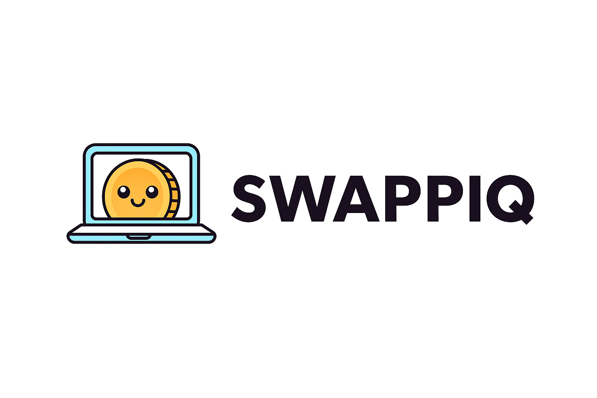

# SwappiQ - Advanced Cross-Chain DEX Aggregator

<div align="center">



**The Most Comprehensive Cross-Chain DEX Aggregator with 48 Supported EVM Chains and 100,000+ Tokens**

[](LICENSE)
[](https://www.typescriptlang.org/)
[](https://nextjs.org/)
[](https://ethereum.org/)

</div>

## 🚀 Overview

SwappiQ is a next-generation decentralized exchange (DEX) aggregator that revolutionizes cross-chain trading. Unlike traditional aggregators, SwappiQ offers unparalleled chain coverage, advanced security features, and innovative revenue-generating mechanisms while maintaining the best possible rates for users.

### 🎯 Key Highlights

- **48 EVM-Compatible Networks**: The most extensive EVM chain support in the DEX aggregator space
- **100,000+ Tokens**: Dynamic token discovery across all supported chains
- **Enterprise-Grade Security**: Multi-layered security with smart contract escrow system
- **Cross-Chain Native**: True cross-chain swaps with bridge aggregation
- **Mobile Optimized**: Dedicated mobile performance optimization service
- **Revenue Generating**: Built-in business model with multiple revenue streams

## 📊 Supported Networks & Token Coverage

### Supported EVM Chains (48 Total)

| Chain Category  | Networks                                        | Estimated Tokens |
| --------------- | ----------------------------------------------- | ---------------- |
| **Layer 1 EVM** | Ethereum, BSC, Avalanche, Fantom, Cronos        | ~15,000+         |
| **Layer 2**     | Arbitrum, Optimism, Base, zkSync, Polygon zkEVM | ~10,000+         |
| **Alt L1s**     | Polygon, Gnosis, Celo, Aurora, Moonbeam         | ~8,000+          |
| **zkEVM Chains**| Scroll, Linea, Taiko, Immutable zkEVM           | ~5,000+          |
| **Emerging**    | Sonic, World Chain, HyperEVM, Lens, Mode        | ~5,000+          |
| **Others**      | 30+ additional EVM chains                       | ~50,000+         |

**Total Token Coverage**: 100,000+ unique tokens across all EVM chains


## 🛡️ Security Architecture

### Smart Contract Security

#### 1. **Escrow System**

- **SecureEscrowV2**: Production-ready escrow with comprehensive security
  - ReentrancyGuard protection
  - Role-based access control (RBAC)
  - Circuit breaker integration
  - MEV protection mechanisms
  - Gas griefing protection

#### 2. **Advanced Security Modules**

- **MEV Protection**: Commit-reveal patterns with flashloan protection
- **Circuit Breaker**: Emergency pause with volume limits
- **Signature Verification**: EIP-712 with replay protection
- **Gas Protection**: Safe transfer patterns with gas limits

### Application Security

#### 1. **Authentication & Authorization**

- JWT-based authentication (7-day expiry)
- Bcrypt password hashing (10 salt rounds)
- Role-based user permissions
- Wallet signature verification

#### 2. **API Security**

- Comprehensive input validation with Zod schemas
- Rate limiting (60 requests/hour for external APIs)
- XSS prevention through sanitization
- CORS configuration

#### 3. **Token Safety**

- Token blacklisting system
- Visual warning system (critical/warning/info levels)
- Automated risk assessment
- Community-driven token reports

## 💡 Unique Features & Differentiators

### 1. **Profitable Quote Service** 💰

Unlike traditional aggregators, SwappiQ implements intelligent revenue generation:

- Smart spread optimization (0.3% default, invisible to users)
- DEX rebate collection (0.5-3% from partners)
- Arbitrage opportunity detection
- Automated revenue accumulation

### 2. **Cross-Chain Architecture** 🌐

- 48 EVM-compatible chains with native routing
- Automatic cross-chain token mapping
- Bridge aggregation (Hop, Stargate, Across, etc.)
- Chain-specific gas optimization

### 3. **Advanced Order Types** 📈

- Market orders with instant execution
- Limit orders with customizable expiry
- P2P trading through escrow
- Order book visualization

### 4. **Mobile-First Optimization** 📱

Dedicated mobile performance service:

- Network-aware optimization (4G/3G/2G)
- Device capability detection
- Progressive image loading
- Request batching for slow connections
- Service Worker offline support

### 5. **Real-Time Features** ⚡

- WebSocket price feeds
- Live quote streaming
- Synthetic quote generation
- Price staleness detection
- Auto-reconnection logic

### 6. **Gas Optimization Engine** ⛽

- Multi-route gas comparison
- Historical gas tracking
- Dynamic pricing tiers
- EIP-1559 optimization
- Route selection by total cost

## 🏗️ Technical Architecture

### Core Technologies

```
Frontend:
├── Next.js 15.3.2
├── React 18.3.1
├── TypeScript 5.0
└── Styled Components

Blockchain:
├── Ethers.js 6.14.4
├── Hardhat
├── OpenZeppelin Contracts
└── EIP-712 Signatures

Backend:
├── Supabase (Database)
├── Redis (Caching)
├── JWT Authentication
└── WebSocket Server

Integrations:
├── LiFi Protocol
├── Uniwswap
```

### Project Structure

```
swappiq/
├── contracts/          # Smart contracts (Escrow, Security modules)
├── src/
│   ├── services/      # Core business logic
│   ├── components/    # React components
│   ├── middleware/    # Express middleware
│   ├── utils/        # Utility functions
│   └── config/       # Configuration files
├── pages/            # Next.js pages
├── public/           # Static assets
└── tests/           # Test suites
```

## 🚀 Getting Started

### Prerequisites

- Node.js v14.17.0 or newer
- Yarn or npm package manager
- Ethereum node access (Infura/Alchemy)
- Private key for contract deployment

### Installation

```bash
# Clone the repository
git clone https://github.com/your-repo/swappiq.git

# Navigate to project directory
cd swappiq

# Install dependencies
yarn install

# Set up environment variables
cp .env.example .env
# Edit .env with your configuration
```

### Configuration

Create a `.env` file with:

```env
# Blockchain
ETHERNODE_URL=https://mainnet.infura.io/v3/{your_project_id}
PRIVATE_KEY=your_private_key_here

# Database
SUPABASE_URL=your_supabase_project_url
SUPABASE_KEY=your_supabase_secret_key

# APIs
LIFI_API_KEY=your_lifi_api_key
ZEROX_API_KEY=your_0x_api_key
ONEINCH_API_KEY=your_1inch_api_key

# Security
JWT_SECRET=your_jwt_secret
```

### Running the Application

```bash
# Development
yarn dev

# Production build
yarn build
yarn start

# Run tests
yarn test

# Deploy contracts
yarn hardhat deploy --network mainnet
```

## 📈 Business Model & Revenue Streams

SwappiQ implements multiple revenue generation mechanisms:

1. **Spread Markup**: 0.3% hidden fee on all swaps
2. **DEX Rebates**: 0.5-3% from integrated DEXs
3. **Arbitrage Capture**: Automated cross-market opportunities
4. **Premium Features**: Advanced order types and analytics (planned)

Revenue is automatically accumulated and transferred when thresholds are met:

- L1 chains: $50 USD threshold
- L2 chains: $10 USD threshold

## 🔐 Security Considerations

### Audits & Testing

- Comprehensive unit test coverage
- Integration tests for all major flows
- Slither static analysis for contracts
- Manual security review completed

### Best Practices

- All user inputs validated and sanitized
- No sensitive data in logs
- Secure key management
- Rate limiting on all endpoints
- Emergency pause mechanisms

### Bug Bounty

We encourage responsible disclosure of security vulnerabilities. Please report any findings to joseph@swappiq.xyz

## 🛠️ API Documentation

### Core Endpoints

```typescript
// Get swap quote
POST /api/quote
{
  "fromToken": "0x...",
  "toToken": "0x...",
  "amount": "1000000000000000000",
  "fromChain": 1,
  "toChain": 137
}

// Execute swap
POST /api/swap
{
  "quote": {...},
  "slippage": 0.5,
  "recipient": "0x..."
}

// Get supported tokens
GET /api/tokens?chain=1

// Get transaction status
GET /api/tx/{hash}
```

### WebSocket Events

```javascript
// Subscribe to price updates
ws.send({
  "action": "subscribe",
  "tokens": ["ETH", "USDC"],
  "chains": [1, 137]
});

// Receive updates
{
  "event": "priceUpdate",
  "data": {
    "token": "ETH",
    "chain": 1,
    "price": 2150.50
  }
}
```

## 🤝 Contributing

We welcome contributions! Please see our [Contributing Guidelines](CONTRIBUTING.md) for details.

### Development Process

1. Fork the repository
2. Create your feature branch (`git checkout -b feature/AmazingFeature`)
3. Commit your changes (`git commit -m 'Add some AmazingFeature'`)
4. Push to the branch (`git push origin feature/AmazingFeature`)
5. Open a Pull Request

## 📄 License

This project is licensed under the MIT License - see the [LICENSE](LICENSE) file for details.

## 🙏 Acknowledgments

- LiFi Protocol for cross-chain infrastructure and other DEX partners
- OpenZeppelin for secure contract libraries
- The DeFi community for continuous support

## 📞 Contact & Support

- **Website**: [swappiq.com](https://swappiq.xyz/)
- **Email**: joseph@swappiq.xyz
- **Discord**: [Join our community](https://discord.com/invite/V6j3GyKv)
- **Twitter**: [@SwappiQ](https://twitter.com/swappiq)

---

<div align="center">
Built with ❤️ by the SwappiQ Team
</div>
