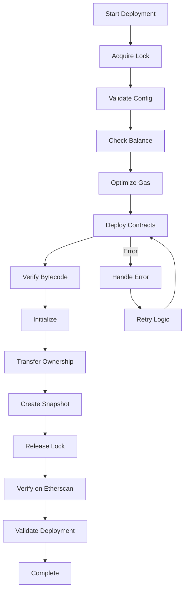

# Enhanced Deployment System Documentation

## Table of Contents
1. [Overview](#overview)
2. [Security Features](#security-features)
3. [Gas Optimization](#gas-optimization)
4. [Edge Case Handling](#edge-case-handling)
5. [Deployment Workflow](#deployment-workflow)
6. [Advanced Usage](#advanced-usage)
7. [Troubleshooting](#troubleshooting)
8. [Architecture](#architecture)

## Overview

This enhanced deployment system provides enterprise-grade smart contract deployment with built-in security, gas optimization, and comprehensive error handling.

### Key Improvements
- 🔒 **Security hardening** - Input validation, bytecode verification, deployment guards
- ⛽ **Gas optimization** - Dynamic pricing, batching, network-specific settings
- 🛡️ **Edge case handling** - Automatic retry, nonce management, RPC failover
- 📊 **Comprehensive monitoring** - Gas tracking, deployment snapshots, audit trails

## Security Features

### 1. Deployment Guard
Prevents concurrent deployments and maintains deployment integrity:

```javascript
const guard = new DeploymentGuard(deploymentDir);
await guard.acquireLock(); // Prevents concurrent deployments
await guard.verifyBytecode(address, bytecode, contractName);
await guard.createSnapshot(deploymentResults);
```

### 2. Configuration Validation
Validates all parameters before deployment:

```javascript
const validator = new DeploymentValidator();
if (!validator.validateConfig(config, network)) {
  validator.printResults();
  throw new Error("Configuration validation failed");
}
```

### 3. Bytecode Verification
Ensures deployed contracts match expected bytecode:
- Removes metadata for accurate comparison
- Detects substitution attacks
- Creates cryptographic checksums

### 4. Automatic Ownership Transfer
For mainnet deployments, automatically transfers ownership to multisig:
```bash
MULTISIG_ADDRESS=0x... npm run deploy:mainnet
```

## Gas Optimization

### 1. Dynamic Gas Pricing
Automatically adjusts gas based on network conditions:

```javascript
const gasOptimizer = new GasOptimizer(network.name);
const gasSettings = await gasOptimizer.getOptimizedGasSettings();

// For EIP-1559 networks:
{
  maxFeePerGas: "50 gwei",
  maxPriorityFeePerGas: "2 gwei"
}
```

### 2. Gas Price Monitoring
Waits for favorable gas prices on mainnet:
```javascript
await gasOptimizer.waitForGoodGasPrice(); // Waits up to 5 minutes
```

### 3. Transaction Batching
Groups similar transactions for efficiency:
```javascript
const batches = await gasOptimizer.optimizeBatchTransaction(transactions);
```

### 4. Gas Usage Tracking
Monitors gas consumption throughout deployment:
```javascript
gasOptimizer.trackGasUsage(receipt, "Contract deployment");
const summary = gasOptimizer.getGasSummary();
// Output: Total cost, operations count, detailed history
```

## Edge Case Handling

### 1. Automatic Retry Logic
Retries failed deployments with exponential backoff:
```javascript
const edgeHandler = new EdgeCaseHandler();
await edgeHandler.retryDeployment(deployFunc, contractName);
```

### 2. Nonce Management
Handles nonce mismatches automatically:
- Detects nonce errors
- Waits for pending transactions
- Resets nonce if needed

### 3. RPC Failover
Switches to backup RPC endpoints on failure:
- Primary RPC from environment
- Automatic failover to public RPCs
- Network-specific backup endpoints

### 4. Network Congestion Handling
Monitors and adapts to network conditions:
- Detects high gas prices
- Waits for block production
- Adjusts timeouts dynamically

## Deployment Workflow

### Complete Deployment Flow



### Step-by-Step Process

1. **Pre-deployment validation**
   - Configuration validation
   - Balance check
   - Gas price analysis
   - Network verification

2. **Deployment execution**
   - Deploy with optimized gas
   - Verify bytecode integrity
   - Track gas usage
   - Handle errors gracefully

3. **Post-deployment**
   - Initialize parameters
   - Set up roles
   - Transfer ownership
   - Create audit trail

## Advanced Usage

### 1. Custom Gas Settings
Override automatic gas optimization:
```bash
MAX_GAS_PRICE=100 npm run deploy:mainnet
```

### 2. Partial Deployment
Deploy specific contracts only:
```bash
npx hardhat run scripts/deploy/01-deploy-core-contracts-secure.js --network mainnet
```

### 3. Dry Run Mode
Test deployment without executing:
```bash
DRY_RUN=true npm run deploy:mainnet
```

### 4. Force Deployment
Skip duplicate deployment check:
```bash
FORCE_DEPLOY=true npm run deploy:mainnet
```

### 5. Custom RPC Endpoints
Use specific RPC with automatic failover:
```bash
MAINNET_RPC_URL=https://custom-rpc.com npm run deploy:mainnet
MAINNET_BACKUP_RPC=https://backup-rpc.com npm run deploy:mainnet
```

## Troubleshooting

### Common Issues and Solutions

#### 1. Deployment Lock Stuck
```bash
# Remove stale lock (only if sure no deployment running)
rm deployments/mainnet/.deployment.lock
```

#### 2. Gas Price Too High
```bash
# Set maximum acceptable gas price
MAX_GAS_PRICE=200 npm run deploy:mainnet
```

#### 3. Nonce Issues
```bash
# Reset nonce by canceling pending transactions
RESET_NONCE=true npm run deploy:mainnet
```

#### 4. RPC Timeout
```bash
# Increase timeout and use backup RPC
RPC_TIMEOUT=60000 npm run deploy:mainnet
```

#### 5. Verification Failures
```bash
# Retry verification with specific contract
npx hardhat verify --network mainnet CONTRACT_ADDRESS "constructor" "args"
```

### Debug Mode
Enable verbose logging:
```bash
DEBUG=* npm run deploy:mainnet
```

### Error Recovery
1. Check error logs in `deployments/network/`
2. Review partial deployment state
3. Use recovery scripts if available
4. Manually complete remaining steps

## Architecture

### Component Overview

```
scripts/deploy/
├── utils/
│   ├── deployment-validator.js    # Configuration validation
│   ├── gas-optimizer.js          # Gas price optimization
│   ├── deployment-guard.js       # Security and locking
│   └── edge-case-handler.js      # Error handling
├── 01-deploy-core-contracts-secure.js
├── 02-deploy-security-modules.js
├── 03-deploy-verification-contracts.js
├── verify-contracts.js
├── initialize-contracts.js
├── validate-deployment.js
└── deploy-all.js
```

### Key Classes

#### DeploymentValidator
- Validates configuration parameters
- Checks address formats
- Ensures parameter bounds
- Validates role separation

#### GasOptimizer
- Monitors gas prices
- Calculates optimal settings
- Supports EIP-1559
- Tracks gas usage

#### DeploymentGuard
- Manages deployment locks
- Verifies bytecode integrity
- Creates deployment snapshots
- Maintains audit trail

#### EdgeCaseHandler
- Automatic retry logic
- Nonce management
- RPC failover
- Error recovery

### Data Flow

1. **Configuration** → Validator → Deployment Scripts
2. **Gas Settings** → Optimizer → Transaction Parameters
3. **Deployment Results** → Guard → Snapshots & Checksums
4. **Errors** → EdgeCaseHandler → Retry/Recovery

## Best Practices Summary

1. **Always validate** - Run validation before and after deployment
2. **Monitor gas** - Use gas optimization for cost efficiency
3. **Handle errors** - Let automatic retry handle transient failures
4. **Verify integrity** - Check bytecode and parameters post-deployment
5. **Transfer ownership** - Move to multisig immediately after deployment
6. **Keep records** - Deployment snapshots are crucial for audits
7. **Test thoroughly** - Use testnets before mainnet deployment

## Performance Metrics

Typical deployment times:
- **Localhost**: 30-60 seconds
- **Testnet**: 2-5 minutes
- **Mainnet**: 5-10 minutes (depends on gas)
- **L2 Networks**: 1-3 minutes

Gas costs (approximate):
- **Core Contracts**: 0.1-0.3 ETH
- **Security Modules**: 0.05-0.15 ETH
- **Full Deployment**: 0.2-0.5 ETH

## Support and Maintenance

### Logs Location
- Deployment results: `deployments/<network>/`
- Error logs: `deployments/<network>/*-error-*.json`
- Gas reports: `deployments/<network>/gas-report.json`
- Snapshots: `deployments/<network>/deployment-snapshot-*.json`

### Monitoring Integration
Compatible with:
- Tenderly
- OpenZeppelin Defender
- Datadog
- Custom webhooks

### Updates
Check for updates regularly:
```bash
npm update
npx hardhat compile --force
```

---

For security best practices, see [SECURITY-BEST-PRACTICES.md](./SECURITY-BEST-PRACTICES.md)